## Лабораторная работа №5

Данная лабораторная работа выполнена на базе лабораторной работы №4

***ВАЖНО!***

**В лабораторной работе все ошибки закомментированы,
для того чтобы одни ошибки не мешали выявлению других**

### Ошибка 1 — изменение пользовательской коллекции во время итерации

Место: goose.py, метод superpower

Симптом:
При удалении игрока из казино один игрок 'пропускается' и к нему не применяется действие суперспособности.

Как воспроизвести:
Запустить симуляцию с steps=20 и seed=4 (на шаге 7 проявляется проблема).

Отладка:
Установим breakpoint на строчку с ```unregister_func(player)```, в окладчике видно,
что игрок bb5d73, который идет после удаленного игрока, пропускается, что не
соответствует ожидаемому поведению.

Причина:
Удаление элемента из пользовательской коллекции во время итерации по ней,
что приводит к пропуску одного элемента, стоящего после удаляемого.

Исправление:

```python
for player in players:
    try:
        player.balance -= self.honk_volume
        casino_balances[player.full_name] = player.balance.count
    except NotEnoughElementsException:
        unregister_func(player)
```

Заменено на:

```python
to_delete = []
for player in players:
    try:
        player.balance -= self.honk_volume
        casino_balances[player.full_name] = player.balance.count
    except NotEnoughElementsException:
        to_delete.append(player)
for player in to_delete:
    unregister_func(player)
```

Проверка:
После изменения поведение симуляции соответствует ожидаемому.

Доказательства:

Состояние до удаления, видно, что текущий элемент игрок 46d4ac, а следующий bb5d73
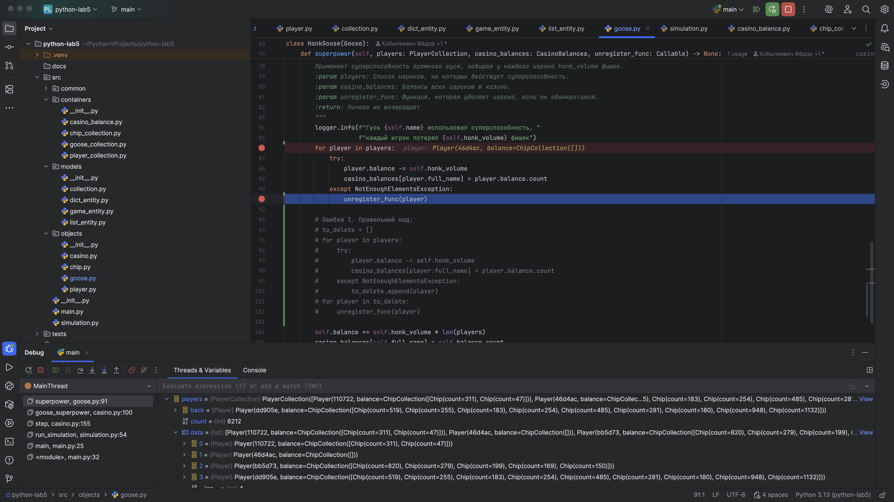
Состояние после удаления, видно, что текущий элемент игрок dd905e, а не bb5d73
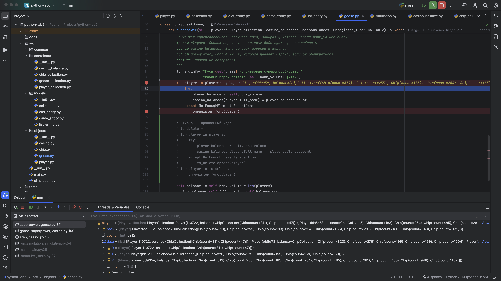

### Ошибка 2 — сравнение через is вместо ==

Место: game_entity.py, метод ```__eq__```

Симптом:
Неправильно происходит сравнение на равенство двух объектов GameEntity
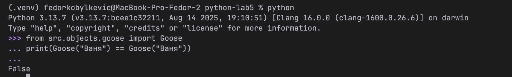
*Примечание: для тестирования, данный код добавлен в main.py в виде комментария*

Как воспроизвести:
Попытаться сравнить два объекта GameEntity на равенство

Отладка:
Установим breakpoint на методе ```__eq__```

Причина:
Использовано неверное сравнение, вместо ```==``` используется ```is```,
что приводит к неправильному сравнению объектов.

Исправление:

```python
return self.name is other.name and self.balance is other.balance
```

Заменено на:

```python
return self.name == other.name and self.balance == other.balance
```

Проверка:
После изменения поведение соответствует ожидаемому.

Доказательства:

Видно, что при сравнении балансов возникает False, хотя балансы одинаковые,
что не соответствует ожидаемому поведению
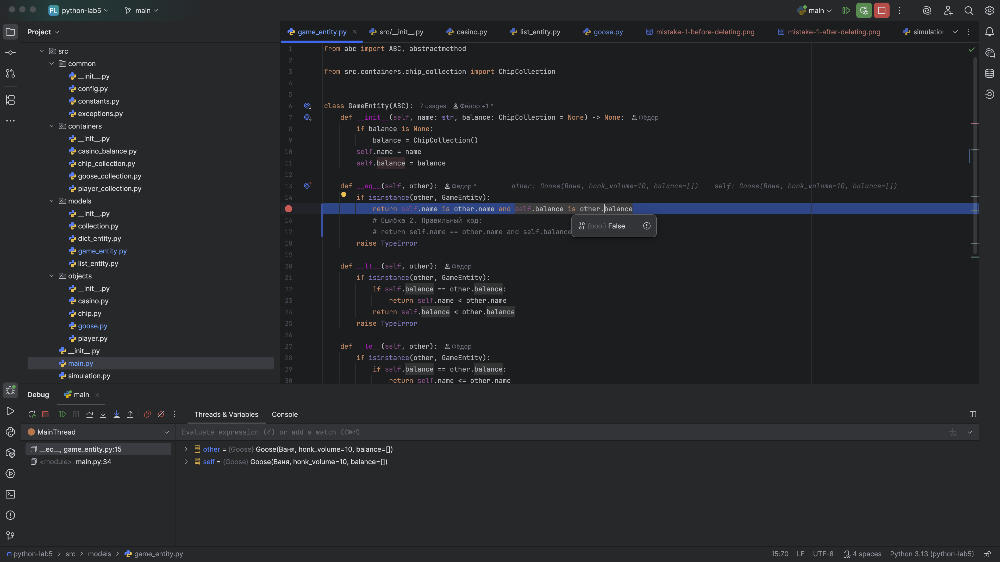

После исправления кода, поведение становиться нормальным
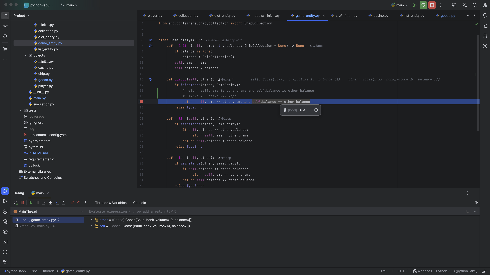

### Ошибка 3 — использование изменяемого значения по умолчанию

Место: list_entity.py, метод ```__init__```

Симптом:
При добавлении элемента в одну коллекцию он добавляется сразу во все возможные коллекции

Как воспроизвести:
Попытаться добавить элемент в одну коллекцию, до этого создав ещё одну коллекцию.
*Примечание: для тестирования, данный код добавлен в main.py в виде комментария*

Отладка:
Установим breakpoint на методе append внутри класса ListEntity

Причина:
Использование в качестве значения по умолчанию пустой list(),
который каждый раз передает одну и ту же ссылку,
тем самым мы каждый раз ссылаемся на один и тот же объект

Исправление:

```python
def __init__(self, data: list[T] = []) -> None:
    for item in data:
        if not isinstance(item, self.expected_type):
            raise TypeError
    self.data = data
```

Заменено на:

```python
def __init__(self, data: list[T] = None) -> None:
    if data is None:
        data = []
    for item in data:
        if not isinstance(item, self.expected_type):
            raise TypeError
    self.data = data
```

Проверка:
После изменения поведение соответствует ожидаемому.

Доказательства:

Видно, что добавляем игрока в изначально пустую коллекцию
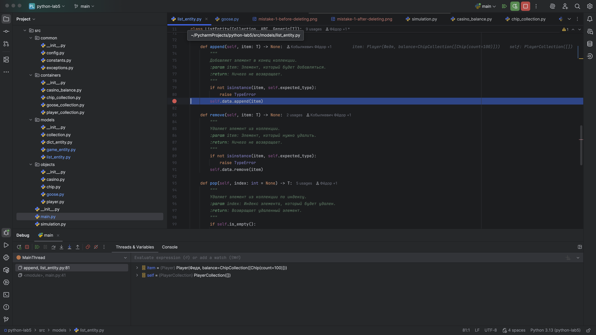

Видим, что игрок добавился также и в коллекцию гусей,
что не соответствует ожидаемому поведению
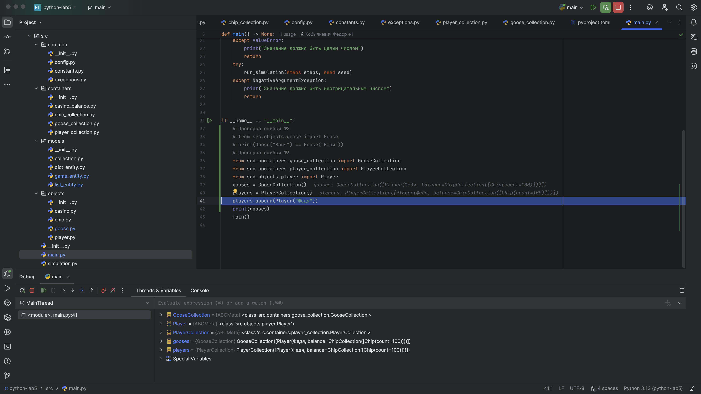

### Ошибка 4 — переданы неправильные аргументы

Место: casino.py, метод ```goose_superpower```

Симптом:
При симуляции не удаляются игроки, которые обанкротились,
вместо этого они начинают дублироваться создавая большой лог

Как воспроизвести:
Запустить симуляцию с steps=100 и seed=1 (на шаге 71 проявляется проблема).

Отладка:
Установим breakpoint на строчке

```python
honk_goose.superpower(self.players, self.casino_balances, self.register_player)
```

внутри метода goose_superpower casino.py,
а также breakpoint внутри метода superpower в классе Goose, на строчке:

```python
unregister_func(player)
```

Причина:
Внутрь метода superpower передается неправильный аргумент функции (unregister_func),
вместо self.unregister_player передается self.register_player.

Исправление:

```python
honk_goose.superpower(self.players, self.casino_balances, self.register_player)
```

Заменено на:

```python
honk_goose.superpower(self.players, self.casino_balances, self.unregister_player)
```

Проверка:
После изменения поведение соответствует ожидаемому.

Доказательства:

Видно, существует обанкротившийся игрок, которого необходимо удалить из списка игроков
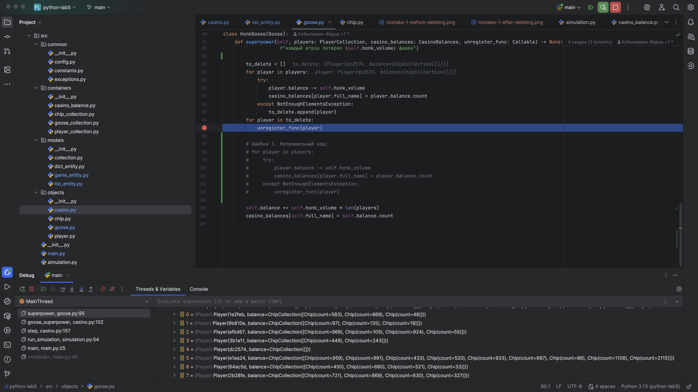

Видим, что обанкротившийся игрок не удаляется из коллекции, а дублируется,
что не соответствует ожидаемому поведению в симуляции.
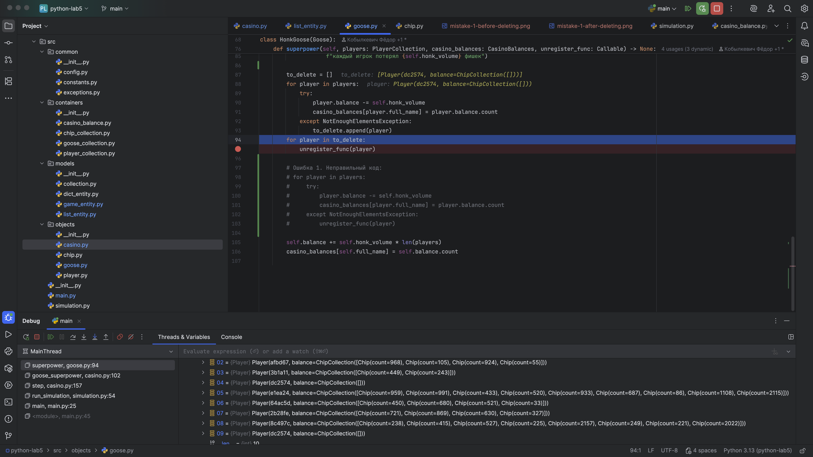

### Ошибка 5 — неверное логичесĸое условие

Место: goose_collection.py, метод ```evolution```

Симптом:
При симуляции эволюции возникает ошибка, что у HonkGoose нет атрибута damage

Как воспроизвести:
Запустить симуляцию с steps=100 и seed=1 (на шагах 23, 59, 95 проявляется проблема).

Отладка:
Установим breakpoint на строчке

```python
if isinstance(goose, HonkGoose):
```

внутри метода evolution goose_collection.py

Причина:
Внутри метода evolution проверяется наследование объекта goose от неправильного класса,
так как у класса HonkGoose не существует атрибута damage, который изменяется

Исправление:

```python
if isinstance(goose, HonkGoose):
```

Заменено на:

```python
if isinstance(goose, WarGoose):
```

Проверка:
После изменения поведение соответствует ожидаемому.

Доказательства:

Видим, что при классе WarGoose значение нашего условия False
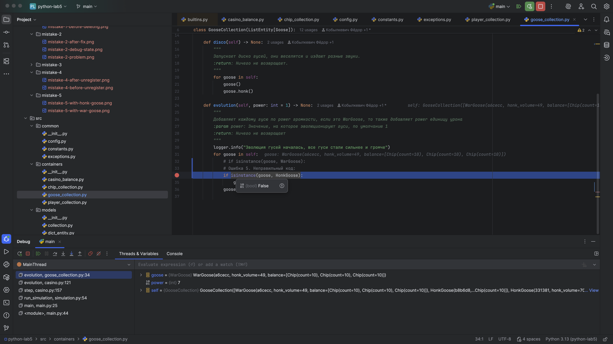

Видим, что при классе HonkGoose значение нашего условия True,
что не соответствует ожидаемому поведению
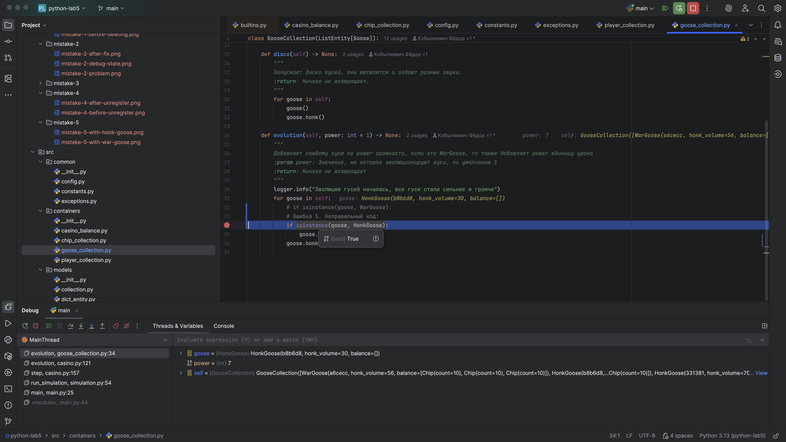
